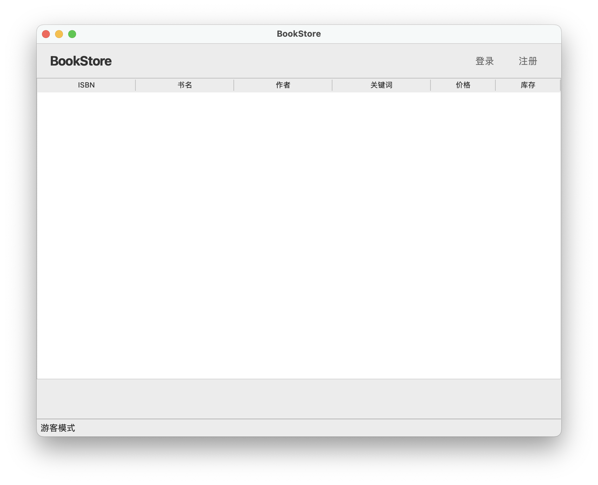

# BookStore 用户手册

**版本**: v1.0.2  
**发布日期**: 2025年12月20日

---

## 目录

1. [系统简介](#系统简介)
2. [快速开始](#快速开始)
3. [用户权限说明](#用户权限说明)
4. [界面导航](#界面导航)
5. [账户管理](#账户管理)
6. [图书管理](#图书管理)
7. [日志与报表](#日志与报表)
8. [高级功能](#高级功能)
9. [中文和日文支持](#中文和日文支持)
10. [常见问题](#常见问题)
11. [操作示例](#操作示例)

---

## 系统简介

BookStore 是一个专业的书店管理系统，提供完整的书店运营管理功能。系统支持图形化界面操作，界面友好，功能全面。

### 核心功能

- **账户管理**: 支持多用户、多权限账户体系
- **图书管理**: 图书信息录入、修改、检索、库存管理
- **销售管理**: 图书购买、进货、库存控制
- **财务管理**: 财务记录、收支统计、报表生成
- **日志系统**: 操作日志、员工工作记录追踪
- **数据导出**: 支持账户、图书、日志数据导出为 CSV 格式

### 用户角色

- **游客** {0}: 未登录用户，仅可注册账户
- **顾客** {1}: 已注册用户，可查询和购买图书
- **员工** {3}: 管理员，可进行图书管理和进货操作
- **店长** {7}: 超级管理员，拥有所有权限

---

## 快速开始

### 首次登录

系统预置默认管理员账户：

- **用户名**: `root`
- **密码**: `sjtu`
- **权限**: 店长 {7}（最高权限）

**重要提示**: 首次登录后，请立即修改默认密码以保证系统安全。

### 基本操作流程

1. **启动应用**: 双击 BookStore 图标
2. **登录系统**: 使用默认账户或已注册账户登录
3. **选择功能**: 点击顶部导航栏切换不同功能模块
4. **执行操作**: 在控制面板进行相应操作
5. **查看结果**: 在表格区域查看数据

---

## 用户权限说明

### 权限等级

系统采用分级权限管理，数字越大权限越高：

| 权限等级 | 角色名称 | 权限说明 |
|---------|---------|---------|
| {0} | 游客 | 未登录状态，仅可注册账户 |
| {1} | 顾客 | 可查询图书、购买图书、修改个人密码 |
| {3} | 员工 | 可执行所有顾客权限，外加图书管理、进货等操作 |
| {7} | 店长 | 拥有所有权限，包括账户管理、图书删除、日志查询、报表生成 |

### 权限规则

- 高权限用户可以执行低权限用户的所有操作
- 仅店长可以删除账户
- 仅店长可以删除图书（v1.0.2 新增）
- 仅店长可以查看财务报表和员工工作日志
- 员工和店长可以创建低于自己权限的账户

### 登录机制

与CLI端的系统不同，本系统无登录栈特性。为了避免操作混乱，同一程序同一时间只允许一个用户处于登录状态。

---

## 界面导航

### 主界面布局



简要说明：
- 顶部导航栏：进入账户、图书、日志与个人相关功能。
- 中部表格区域：按当前模块显示数据列表（支持排序与选择）。
- 底部控制面板：提供添加、修改、搜索、进货、删除、导出等操作入口。
- 状态栏：显示当前登录用户与操作提示。
- 本界面全面支持中文和日文显示与检索（详见"中文和日文支持"章节）。

### 顶部导航栏

- **[账户]**: 切换到账户管理视图
- **[图书]**: 切换到图书管理视图（默认页面）
- **[日志]**: 切换到日志查询视图（仅店长可见）
- **[登录]**: 显示登录对话框（未登录时）
- **[注册]**: 显示注册对话框（未登录时）
- **[个人信息]**: 查看当前用户信息（已登录时）
- **[注销]**: 注销当前登录账户（已登录时）

### 状态栏

状态栏显示：
- 当前登录状态（如"已登录: root"或"游客模式"）

---

## 账户管理

### 注册新账户

**适用权限**: 游客 {0}

**操作步骤**:
1. 点击顶部导航栏的「注册」按钮
2. 在弹出对话框中输入：
   - **用户 ID**: 30 字符以内，仅限数字、字母、下划线
   - **密码**: 30 字符以内，仅限数字、字母、下划线
   - **用户名**: 30 字符以内，支持中文、英文及其他 UTF-8 可见字符
3. 点击「确定」完成注册
4. 注册成功后获得顾客 {1} 权限

**注意事项**:
- 用户 ID 不能与已有账户重复
- 所有字段必填
- 密码建议使用字母数字组合

### 登录账户

**适用权限**: 游客 {0}

**操作步骤**:
1. 点击顶部导航栏的「登录」按钮
2. 输入用户 ID 和密码
3. 点击「确定」登录

### 修改密码

**适用权限**: 顾客 {1} 及以上

**操作步骤**:
1. 点击顶部导航栏的「个人信息」
2. 在个人信息对话框中点击「修改密码」
3. 输入：
   - 用户 ID（要修改密码的账户）
   - 当前密码（如果是店长修改其他账户，可省略）
   - 新密码
4. 点击「确定」

**注意事项**:
- 店长 {7} 可以省略当前密码，直接重置任何账户密码
- 普通用户只能修改自己的密码

### 创建账户（员工/店长）

**适用权限**: 员工 {3} 及以上

**操作步骤**:
1. 切换到「账户」视图
2. 在底部控制面板点击「添加账户」
3. 输入：
   - **用户 ID**: 新账户的 ID
   - **密码**: 新账户的密码
   - **权限等级**: 1（顾客）或 3（员工）
   - **用户名**: 新账户的显示名称
4. 点击「确定」创建

**权限限制**:
- 员工 {3} 只能创建顾客 {1} 账户
- 店长 {7} 可以创建顾客 {1} 和员工 {3} 账户
- 不能创建权限等于或高于自己的账户

### 删除账户

**适用权限**: 店长 {7}

**操作步骤**:
1. 切换到「账户」视图
2. 在表格中选择要删除的账户
3. 点击底部控制面板的「删除账户」按钮
4. 确认删除

**注意事项**:
- 无法删除当前已登录的账户
- 删除操作不可恢复，请谨慎操作
- 建议定期备份重要账户数据

### 查询账户

**适用权限**: 员工 {3} 及以上

**操作步骤**:
1. 切换到「账户」视图
2. 点击「搜索账户」按钮
3. 输入搜索条件：
   - 用户 ID（可选）
   - 权限等级（可选）
4. 点击「搜索」

查询结果将在表格中显示。

### 账户登录（员工功能）

**适用权限**: 员工 {3} 及以上

允许员工快速切换登录不同账户：

**操作步骤**:
1. 在账户控制面板点击「登录账户」
2. 在表格中选择要登录的账户
3. 输入该账户的密码（如当前权限够高可省略）
4. 点击「确定」

---

## 图书管理

### 图书信息说明

每本图书包含以下信息：

| 字段 | 说明 | 格式要求 | 必填 |
|------|------|---------|------|
| ISBN | 国际标准书号，唯一标识 | 20 字符以内，可见 ASCII 字符 | ✓ |
| 书名 | 图书名称 | 60 字符以内，支持中文、日文与英文（不含双引号） | ✗ |
| 作者 | 作者姓名 | 60 字符以内，支持中文、日文与英文（不含双引号） | ✗ |
| 关键字 | 用竖线分隔的多个关键词 | 60 字符以内，支持中文、日文与英文，如 "小说\|文学\|経典" | ✗ |
| 单价 | 图书售价 | 小数点后两位，如 45.50 | ✓ |
| 库存 | 当前库存数量 | 整数 | - |

**注**: 
- 仅 ISBN 和单价为必填项
- 书名、作者、关键字可留空（v1.0.2 新增可选）
- 新添加图书的库存初始值为 0

### 检索图书

**适用权限**: 顾客 {1} 及以上

**操作步骤**:

**方式一：查看全部图书**
1. 切换到「图书」视图
2. 表格默认显示所有图书，按 ISBN 升序排列

**方式二：条件检索**
1. 点击「搜索图书」按钮
2. 选择搜索条件（可选其一）：
   - **ISBN**: 精确匹配
   - **书名**: 精确匹配
   - **作者**: 精确匹配
   - **关键字**: 单个关键词匹配
3. 输入搜索内容
4. 点击「搜索」

**结果显示**:
- 符合条件的图书在表格中显示
- 按 ISBN 字典升序排列
- 显示格式：ISBN、书名、作者、关键字、单价、库存

**注意事项**:
- 关键字搜索时，只能输入单个关键词，不能用竖线分隔
- 搜索条件为空时返回所有图书
- 每次只能使用一个搜索条件

### 购买图书

**适用权限**: 顾客 {1} 及以上

**操作步骤**:
1. 在图书表格中选择要购买的图书
2. 点击「购买」按钮
3. 在弹出对话框中：
   - 确认图书 ISBN 和当前单价
   - 输入购买数量（正整数）
4. 点击「确定」

**系统处理**:
- 计算总价 = 单价 × 数量
- 减少图书库存
- 记录交易到财务日志
- 显示交易总金额

**注意事项**:
- 购买数量不能超过当前库存
- 购买数量必须为正整数
- 交易完成后无法撤销

### 添加新图书

**适用权限**: 员工 {3} 及以上

**操作步骤**:
1. 切换到「图书」视图
2. 点击「添加图书」按钮
3. 在对话框中填写图书信息：
   - ISBN（必填，唯一）
   - 书名（可选，v1.0.2 改为可选）
   - 作者（可选，v1.0.2 改为可选）
   - 关键字（可选，v1.0.2 改为可选）
   - 单价（必填，保留两位小数）
4. 点击「确定」

**注意事项**:
- ISBN 和单价为必填项
- 书名、作者、关键字可留空
- ISBN 不能与现有图书重复
- 如果提供了关键字，其中不能有重复的词
- 新添加的图书初始库存为 0，需通过进货增加库存

### 修改图书信息

**适用权限**: 员工 {3} 及以上

**操作步骤**:
1. 在图书表格中选择要修改的图书
2. 点击「修改」按钮
3. 在对话框中修改需要更改的字段：
   - ISBN（可修改为其他未使用的 ISBN）
   - 书名
   - 作者
   - 关键字
   - 单价
4. 点击「确定」

**注意事项**:
- 至少修改一个字段
- 不能将 ISBN 改为已存在的 ISBN
- 不能将 ISBN 改为与当前相同的值
- 修改关键字时，不能包含重复词
- 修改不影响库存数量
- 可将书名、作者、关键字改为空（v1.0.2 新增）

### 图书进货

**适用权限**: 员工 {3} 及以上

**操作步骤**:
1. 在图书表格中选择要进货的图书
2. 点击「进货」按钮
3. 在对话框中输入：
   - **进货数量**: 正整数
   - **进货总成本**: 正数，保留两位小数
4. 点击「确定」

**系统处理**:
- 增加图书库存
- 记录进货成本到财务日志
- 更新库存显示

**注意事项**:
- 进货数量必须为正整数
- 进货总成本必须为正数
- 进货会增加系统支出

### 删除图书

**适用权限**: 店长 {7}（仅店长可删除图书）

**操作步骤**:
1. 在图书表格中选择要删除的图书
2. 点击「删除」按钮
3. 在对话框中确认图书 ISBN
4. 点击「确定」完成删除

**系统处理**:
- 从系统中删除图书记录
- 同步清除所有索引（ISBN、书名、作者、关键词）
- 记录删除操作到日志

**注意事项**:
- ⚠️ **删除操作不可逆**，请谨慎操作
- 仅店长 {7} 可执行此操作，员工和顾客无权删除
- 删除后无法恢复，建议操作前备份数据
- 系统会显示警告提示

### 选择图书（高级功能）

**适用权限**: 员工 {3} 及以上

选择功能用于后续的修改和进货操作：

**操作步骤**:
1. 在图书表格中点击某一行图书
2. 该图书自动被选中，可执行修改或进货操作

**特殊情况**:
- 如果输入不存在的 ISBN 进行选择，系统会创建仅包含该 ISBN 的新图书条目
- 创建后需要使用修改功能补全其他信息

---

## 日志与报表

日志功能仅店长 {7} 可访问。

### 财务记录查询

**适用权限**: 店长 {7}

**操作步骤**:
1. 切换到「日志」视图
2. 点击「财务查询」按钮
3. 输入查询笔数：
   - 留空：查询所有交易
   - 输入数字 N：查询最近 N 笔交易
4. 点击「查询」

**显示格式**:
```
+ [总收入] - [总支出]
```

例如：`+ 12345.67 - 8900.00`

**说明**:
- 收入：所有购买图书的销售额
- 支出：所有进货的成本
- 交易按时间倒序排列（最新的在前）

### 财务报表

**适用权限**: 店长 {7}

**操作步骤**:
1. 切换到「日志」视图
2. 点击「财务报表」按钮
3. 在对话框中输入查询时间范围（可选）
4. 系统生成详细财务报表

**报表内容**:
- 交易明细（时间、类型、ISBN、数量、金额）
- 收入统计
- 支出统计
- 利润计算
- 图表展示（如有）

**导出功能**:
- 支持导出为 CSV 格式
- 可用 Excel 等工具打开分析

### 员工工作报告

**适用权限**: 店长 {7}

**操作步骤**:
1. 切换到「日志」视图
2. 点击「员工报告」按钮
3. 选择要查询的员工（可选）
4. 输入时间范围（可选）
5. 系统生成员工工作报告

**报告内容**:
- 操作时间
- 操作类型（如创建账户、修改图书、进货等）
- 操作对象（具体的账户 ID 或图书 ISBN）
- 操作结果

**用途**:
- 监控员工工作
- 审计操作记录
- 追踪责任

### 系统日志

**适用权限**: 店长 {7}

**操作步骤**:
1. 切换到「日志」视图
2. 点击「系统日志」按钮（或直接查看日志表格）
3. 使用「搜索日志」进行筛选：
   - 按操作类型
   - 按操作用户
   - 按时间范围

**日志类型**:
- 账户操作（登录、注册、修改密码等）
- 图书操作（添加、修改、删除等）
- 交易记录（购买、进货等）
- 系统事件

**日志字段**:
- 时间戳
- 操作用户
- 操作类型
- 操作对象
- 操作结果

---

## 高级功能

### 数据导出

**版本要求**: v1.0.1+

系统支持将账户、图书、日志数据导出为 CSV 格式，方便使用 Excel 等工具分析。

#### 导出账户数据

**适用权限**: 员工 {3} 及以上

**操作步骤**:
1. 切换到「账户」视图
2. 点击「导出 CSV」按钮
3. 选择保存位置和文件名
4. 系统自动添加 `.csv` 扩展名（如未提供）
5. 导出完成后显示文件完整路径

**导出内容**:
- 用户 ID
- 用户名
- 权限等级

#### 导出图书数据

**适用权限**: 员工 {3} 及以上

**操作步骤**:
1. 切换到「图书」视图
2. 点击「导出 CSV」按钮
3. 选择保存位置和文件名
4. 导出完成

**导出内容**:
- ISBN
- 书名
- 作者
- 关键字
- 单价
- 库存

#### 导出日志数据

**适用权限**: 店长 {7}

**操作步骤**:
1. 切换到「日志」视图
2. 点击「导出日志」按钮
3. 选择导出格式（CSV 或 TXT）
4. 选择保存位置
5. 导出完成

**导出内容**:
- 所有日志记录
- 包含完整的时间、用户、操作详情

**改进说明**（v1.0.1）:
- 修复了导出目录不明确的问题
- 自动补全文件扩展名
- 提供清晰的成功/失败提示（含完整路径）

---

## 中文和日文支持

本系统现已全面支持中文和日文输入、显示与检索。

### 支持语言

系统支持的输入字符类型包括：

| 语言 | 支持字段 | 字符类型 | 说明 |
|------|---------|---------|------|
| 中文 | 用户名、书名、作者、关键字 | 汉字、ASCII字母 | 支持简体和繁体汉字 |
| 日文 | 用户名、书名、作者、关键字 | 平假名、片假名、汉字、ASCII字母 | v1.0.2 新增 |
| 英文 | 所有字段 | ASCII字母、数字、符号 | 全部支持 |

### 输入与显示

- **编码**：所有文本以 UTF-8 存储与导出
- **书名/作者**：不允许包含双引号（"），以避免与数据格式冲突
- **关键字**：
  - 多个关键词使用竖线 `|` 分隔
  - 单个关键词中不应包含 `|`
  - 支持中文关键词、日文关键词或英文关键词混合
- **ISBN**：仍要求为可见 ASCII 字符（不支持中文、日文），以确保唯一性与兼容性
- **用户 ID、密码**：规则不变，仅限数字、字母、下划线
- **日文特殊字符**：支持常用标点如「〜」「ー」「・」等

### 检索与排序

- 图书搜索中的「书名」「作者」「关键字」均支持中文和日文精确匹配
- 关键字搜索仍为单个关键词匹配（输入一个关键词即可匹配含该词的图书）
- 列表默认排序规则不变（按 ISBN 字典序）
- 用户名搜索支持中文和日文匹配

### 使用示例

**中文示例**:
- 书名：`活着`
- 作者：`余华`
- 关键字：`小说|当代|文学`
- 用户名：`张三`

**日文示例**:
- 書名：`ノルウェイの森` (Norwegian Wood - Japanese title)
- 著者：`村上春樹`
- キーワード：`小説|現代文学|恋愛`
- ユーザー名：`田中太郎`

**混合示例**:
- 书名为 `算法（第4版）：基础`（中文）
- 作者为 `Robert Sedgewick`（英文）
- 关键字为 `CS|教材|计算机科学`（中英混合）

### 导出与打开

- 导出的 CSV 文件采用 UTF-8 编码
- **Excel 打开乱码解决**：
  1. 选择「数据」>「从文本导入」
  2. 选择编码为「UTF-8」
  3. 点击完成
- 推荐使用 WPS Office、Google Sheets 等工具，可自动识别 UTF-8

### 技术细节

系统使用 Unicode 标准字符脚本识别技术，支持以下脚本：
- **汉字**: CJK 统一汉字块（包括简体、繁体、日文常用汉字）
- **平假名**（ひらがな）: U+3040-U+309F
- **片假名**（カタカナ）: U+30A0-U+30FF
- **日文标点**: 多种常用符号

## 常见问题

### Q1: 忘记密码怎么办？

**A**: 
- 如果您是普通用户，请联系店长重置密码
- 如果您是店长且忘记了 root 密码，需要：
  1. 完全退出应用
  2. 删除数据目录中的账户数据文件
  3. 重新启动应用（会重置为默认 root/sjtu）

### Q2: 购买图书后能退货吗？

**A**: 当前版本不支持退货功能。购买操作一旦完成即无法撤销。建议：
- 购买前仔细确认数量
- 测试环境可以通过删除数据文件重置系统

### Q3: 如何备份数据？

**A**: 
1. 完全退出应用
2. 复制数据目录（见安装手册）到安全位置
3. 恢复时，将备份文件复制回数据目录

此外，也可以使用 CSV 文件进行备份。

### Q4: 可以同时打开多个应用实例吗？

**A**: 不建议。多个实例可能导致数据文件冲突和数据损坏。

### Q5: 导出的 CSV 文件乱码怎么办？

**A**: 
- 使用 Excel 打开时，选择「数据」>「从文本导入」
- 选择编码为 UTF-8
- 或使用 WPS、Google Sheets 等工具打开

### Q6: 图书库存可以为负数吗？

**A**: 不可以。系统会阻止购买数量超过库存的操作。

### Q7: 关键字搜索只能用一个词吗？

**A**: 是的。当前版本关键字搜索只支持单个关键词。如果图书有多个关键词（用竖线分隔），搜索时只需输入其中一个即可匹配。

### Q8: 能否修改 root 账户的权限？

**A**: 不可以。root 账户是系统预置的超级管理员，权限固定为 {7}，无法修改或删除。

### Q9: 系统最多支持多少账户和图书？

**A**: 理论上支持约 10 万个账户和 10 万本图书。实际使用中，性能取决于硬件配置。

---

## 操作示例

### 示例 1: 顾客购书流程

**场景**: 新顾客注册并购买图书

1. 启动应用（处于游客状态）
2. 点击「注册」
3. 输入用户 ID: `customer01`, 密码: `pass123`, 用户名: `张三`
4. 点击「确定」完成注册
5. 点击「登录」
6. 输入用户 ID: `customer01`, 密码: `pass123`
7. 登录成功，自动跳转到图书视图
8. 点击「搜索图书」
9. 选择「书名」，输入 `Data_Structures`
10. 点击「搜索」，表格显示匹配的图书
11. 选中目标图书，点击「购买」
12. 输入数量 `2`
13. 点击「确定」，系统显示总价并完成购买
14. 状态栏显示"购买成功"

### 示例 2: 员工进货流程

**场景**: 员工为缺货图书进货

1. 以员工账户登录（如 `employee01`）
2. 切换到图书视图
3. 在表格中找到库存较低的图书（如《Data Structures》，库存 5）
4. 选中该图书
5. 点击「进货」按钮
6. 输入进货数量 `100`
7. 输入进货总成本 `2000.00`
8. 点击「确定」
9. 系统增加库存至 105，记录进货成本
10. 状态栏显示"进货成功"

### 示例 3: 店长查看财务报表

**场景**: 店长查询本月财务状况

1. 以 root 账户登录
2. 点击顶部导航栏的「日志」
3. 点击「财务报表」按钮
4. 在对话框中输入时间范围（如 2025-12-01 到 2025-12-31）
5. 点击「生成报表」
6. 点击「导出」保存为 TXT 文件

### 示例 4: 店长创建员工账户

**场景**: 店长为新入职员工创建账户

1. 以 root 账户登录
2. 切换到「账户」视图
3. 点击「添加账户」
4. 填写表单：
   - 用户 ID: `employee05`
   - 密码: `emp123456`
   - 权限等级: `3`（员工）
   - 用户名: `李四`
5. 点击「确定」
6. 账户列表中出现新账户
7. 状态栏显示"创建成功"

### 示例 5: 员工添加新书并进货

**场景**: 新书上架流程

1. 以员工账户登录
2. 切换到图书视图
3. 点击「添加图书」
4. 填写图书信息：
   - ISBN: `9781234567890`
   - 书名: `Linear_Algebra`
   - 作者: `Strang`
   - 关键字: `Math|Textbook`
   - 单价: `107.90`
5. 点击「确定」，新书添加成功（库存 0）
6. 在表格中选中刚添加的图书
7. 点击「进货」
8. 输入数量 `10`，成本 `800.00`
9. 点击「确定」，库存更新为 10

### 示例 6: 修改图书信息

**场景**: 纠正图书信息错误

1. 以员工账户登录
2. 切换到图书视图
3. 搜索或浏览找到目标图书（如 ISBN `9781234567890`）
4. 选中该图书
5. 点击「修改」
6. 修改字段：
   - 单价从 `107.90` 改为 `120.00`
   - 关键字添加新词：`Math|Textbook|LinearAlgebra`
7. 点击「确定」
8. 表格自动刷新，显示更新后的信息

### 示例 7: 搜索和过滤

**场景**: 查找特定作者的所有图书

1. 切换到图书视图
2. 点击「搜索图书」
3. 选择搜索条件「作者」
4. 输入 `Strang`
5. 点击「搜索」
6. 表格显示所有 `Strang` 的作品
7. 可在结果中进一步选择操作

---

## 附录

### 数据格式说明

#### 账户数据

```
UserID: 字符串(30)，数字/字母/下划线
Password: 字符串(30)，数字/字母/下划线  
Username: 字符串(30)，UTF-8 可见字符，支持中文
Privilege: 整数，1|3|7
```

#### 图书数据

```
ISBN: 字符串(20)，可见 ASCII，唯一
BookName: 字符串(60)，UTF-8 可见字符（不含"），支持中文
Author: 字符串(60)，UTF-8 可见字符（不含"），支持中文
Keyword: 字符串(60)，UTF-8 可见字符，用 | 分隔，支持中文
Price: 浮点数(13)，保留两位小数
Quantity: 整数，0-2147483647
```

#### 日志数据

```
Timestamp: ISO 8601 格式
UserID: 操作用户
Operation: 操作类型
Target: 操作对象
Result: 操作结果
```

### 常用操作对照表

| 操作 | 所需权限 | 快捷访问 |
|------|---------|---------|
| 注册账户 | {0} | 顶部导航 > 注册 |
| 登录 | {0} | 顶部导航 > 登录 |
| 查询图书 | {1} | 图书视图 > 搜索图书 |
| 购买图书 | {1} | 图书视图 > 选择图书 > 购买 |
| 修改密码 | {1} | 顶部导航 > 个人信息 > 修改密码 |
| 添加图书 | {3} | 图书视图 > 添加图书 |
| 修改图书 | {3} | 图书视图 > 选择图书 > 修改 |
| 图书进货 | {3} | 图书视图 > 选择图书 > 进货 |
| 删除图书 | {7} | 图书视图 > 选择图书 > 删除 |
| 创建账户 | {3} | 账户视图 > 添加账户 |
| 删除账户 | {7} | 账户视图 > 选择账户 > 删除 |
| 财务查询 | {7} | 日志视图 > 财务查询 |
| 财务报表 | {7} | 日志视图 > 财务报表 |
| 员工报告 | {7} | 日志视图 > 员工报告 |
| 系统日志 | {7} | 日志视图 |

### 术语表

- **ISBN**: International Standard Book Number，国际标准书号
- **登录栈**: 系统维护的登录账户列表，支持嵌套登录
- **权限等级**: 用数字表示的用户权限，0/1/3/7
- **交易**: 包括购买（收入）和进货（支出）
- **日志**: 系统记录的所有操作历史
- **CSV**: Comma-Separated Values，逗号分隔值文件格式

### 版本更新记录

#### v1.0.2 (2025-12-20)
- **新功能**：中文与日文支持（汉字、标点、平假名、片假名）
  - 用户名支持中文、日文输入
  - 书名、作者支持中文、日文输入
  - 关键字支持中文、日文输入和检索
  - 新增多种日中文、日文标点符号识别
- **新功能**：图书删除功能
  - 店长 {7} 可删除图书
  - 自动清理所有索引
  - 完整的删除日志记录
- **改进**：表单验证优化
  - 书名、作者、关键字改为可选字段
  - 仅 ISBN 和单价为必填项
  - 关键字为空时跳过重复检查
- **改进**：序列化优化，删除后数据恢复处理
- **改进**：权限细分，明确员工和店长的图书管理权限

#### v1.0.1 (2025-12-17)
- 修复文件导出功能问题
- 改进错误提示信息
- 增强导出流程稳定性
- CSV 导出目录选择优化
- 文件扩展名自动补全

#### v1.0.0 (2025-12-15)
- 首次正式发布
- 完整的账户、图书、日志功能
- 图形化界面
- 数据导出支持
- 中文支持

---

## 联系与支持

如有问题或建议，请：

1. 查阅本手册和安装手册
2. 访问项目主页：https://github.com/TfOi9/BookStore
3. 提交 Issue 或联系技术支持

**感谢使用 BookStore 书店管理系统！**

---

*本手册最后更新: 2025年12月25日*
