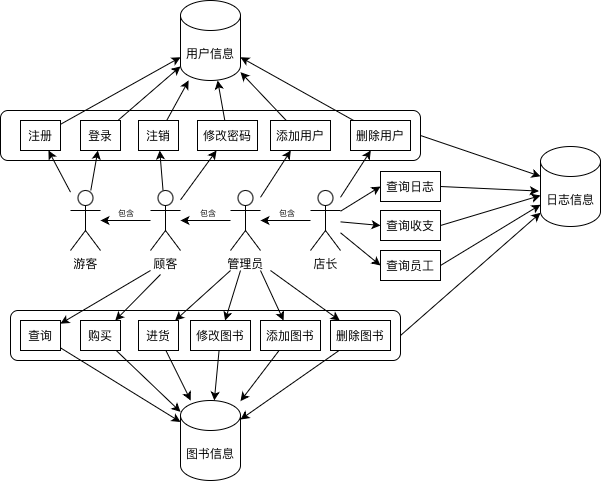

# BookStore 需求分析文档

## 业务流图

## 数据流图

## 数据格式

### 用户信息

- 用户 ID：字符串，最多30个字符，每个用户唯一；
- 用户名：字符串，最多30个字符；
- 密码：字符串，最多30个字符；
- 权限等级：整数，仅能为0，1，3，7，分别代表游客、顾客、管理员和店长。

### 图书信息

- ISBN 号：字符串，最多20个字符，每本书唯一；
- 书名：字符串，最多60个字符；
- 作者：字符串，最多60个字符；
- 关键字：字符串，包含一个或多个不重复的关键字，最多60个字符；
- 库存量：整数；
- 单价：非负实数。

### 日志信息

- 普通日志：字符串，记录一条日志信息，例如登录操作、购买操作等，最多200个字符；
- 财务日志：一个实数与一个时间戳，表示购买或进货操作的收支情况，实数为正表示收入，实数为负表示支出；
- 员工日志：字符串，记录员工的各项操作，最多200个字符。

## 功能说明

### 用户系统

首次运行时，将自动注册用户 ID 为 root ，密码为 sjtu 的店长用户；程序开始运行时，默认登入游客账户。

- 注册：注册一个顾客账号

  参数：用户 ID；用户名；密码；

  权限要求：无

- 登录：登录一个已有账号

  参数：用户 ID；密码（可选）；

  权限要求：无

  注：权限更高的用户可以不输入密码，直接登录权限更低的用户账号。

- 注销：登出当前账号

  参数：无

  权限要求：顾客

  注：游客账户不能登出。

- 修改密码：修改已有用户的密码

  参数：用户 ID；原密码（可选）；新密码；

  权限要求：顾客

  注：权限更高的用户可以不输入原密码，直接修改。

- 创建用户：直接创建一个新的账号

  参数：用户 ID；用户名；权限等级；密码；

  权限要求：管理员

- 删除用户：直接删除账号

  参数：用户 ID

  权限要求：店长

### 图书系统

首次运行时，图书库为空。

- 查询图书：按 ISBN 号 / 书名 / 作者 / 关键字查询书籍信息

  参数：ISBN号 / 书名 / 作者 / 关键字

  权限要求：顾客

- 新增图书：在书库中添加图书信息

  参数：ISBN 号；书名（可选）；作者（可选）；关键字（可选）；单价（可选）；

  权限要求：管理员

  注：修改后的 ISBN 号不能和已有的重复，否则操作失败。

- 修改图书：修改书库中某本书的信息：

  参数：ISBN 号（可选）；书名（可选）；作者（可选）；关键字（可选）；单价（可选）；

  权限要求：管理员

  注：修改后的 ISBN 号不能和已有的重复，否则操作失败。

- 购买图书：购买书库中的某本图书

  参数：ISBN 号；购买数量；

  权限要求：顾客

  注：若购买数量大于库存量，则操作失败。

- 进货：增加某本图书的库存量

  参数：ISBN 号；进货数量；

  权限要求：管理员

- 删除图书：将一本书从书库中删除

  参数：ISBN 号

  权限要求：管理员

### 日志系统

日志分为三种：普通日志、财务日志和员工日志。

- 普通日志：包含操作时间、操作种类、操作的参数。

- 财务日志：包含操作时间、收支情况。

- 员工日志：包含操作时间、操作种类、操作员工、操作的参数。

日志包含以下的查询指令，权限要求均为店长：

- 查询所有普通日志

- 生成财务报表

- 生成员工工作报告

